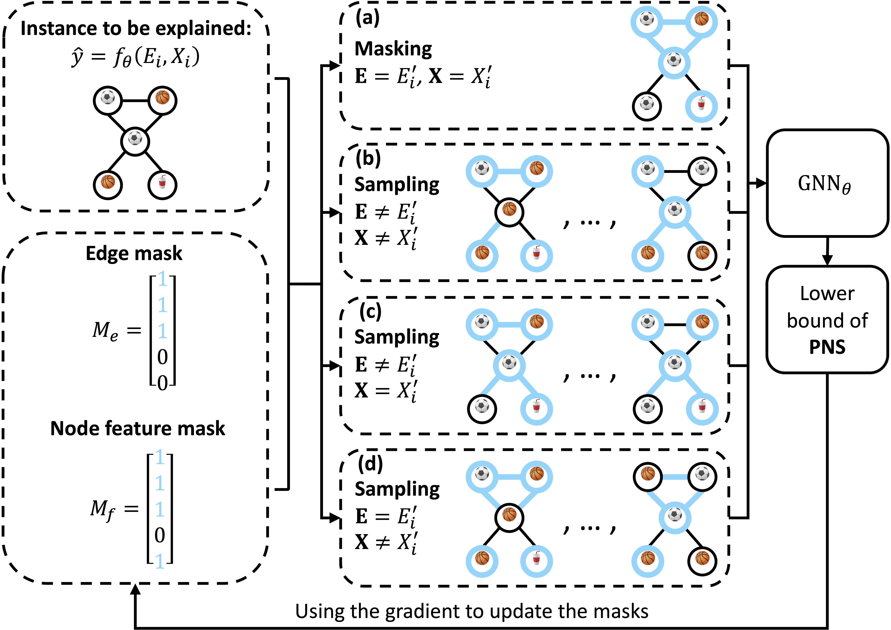

# On the Probability of Necessity and Sufficiency of Explaining Graph Neural Networks: A Lower Bound Optimization Approach

This repository is the official implementation of our paper [On the Probability of Necessity and Sufficiency of Explaining Graph Neural Networks: A Lower Bound Optimization Approach](https://arxiv.org/abs/2212.07056).
In this work we propose NSEG, a framework that can generate Necessary and Sufficient Explanation for GNN via the Probability of Necessity and Sufficiency (PNS).



## Example of explaining node
```
explainer = NSEG(model=model,
                 num_hops=num_layers,
                 alpha_e=alpha_e,
                 beta_e=beta_e,
                 alpha_f=alpha_f,
                 beta_f=beta_f,
                 num_epochs=num_epochs,
                 objective=objective,
                 type_ex=type_ex,
                 device=device)    
mask_edge_explanation, edge_ids = explainer.explain_node(node_idx, graph, features)
```

## Example of explaining graph
```
explainer = NSEG(model=model,
                 num_hops=num_layers,
                 alpha_e=alpha_e,
                 beta_e=beta_e,
                 alpha_f=alpha_f,
                 beta_f=beta_f,
                 num_epochs=num_epochs,
                 objective=objective,
                 type_ex=type_ex,
                 lr=lr,
                 device=device)    
mask_edge_explantion, edges_ids = explainer.explain_graph(graph_idx, graph, features)                                          
```

